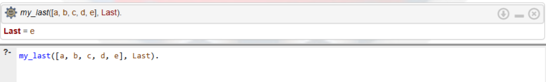
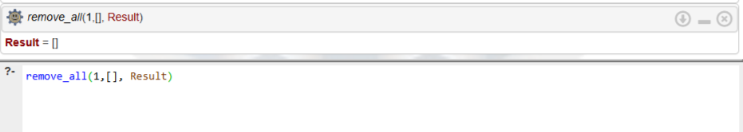

# Лабораторная работа 2: Списки на языке Prolog
## Цель работы
Приобрести навыки рекурсивной обработки рекурсивных структур данных; научиться интерпретировать (переводить на естественный язык) Пролог-программы

## Задание 1. Определение последнего элемента списка
**(Вариант индивидуального задания №8)**

**Декларативная интерпретация:** Последний элемент одноэлементного списка — это и есть этот единственный элемент. Если список содержит более одного элемента, то последний элемент этого списка равен последнему элементу его хвоста.  
**Процедурная интерпретация:** Чтобы найти последний элемент списка, нужно проверить: если список содержит лишь один элемент, то предъявить в качестве результата этот первый элемент. Иначе: отделить голову списка, рекурсивно найти последний элемент в оставшемся хвосте и выдать его как результат.

### Тестирование программы и результаты:

1. **Найти последний элемент обычного списка.**
   * **Объяснение:** Рекурсия последовательно отбрасывает элементы с начала списка, пока не дойдет до списка из одного элемента `[e]`. Алгоритм возвращает этот единственный элемент.
   
   

2. **Проверить, является ли элемент последним (верно).**
   * **Объяснение:** Prolog проверяет истинность утверждения. Поскольку последним элементом списка действительно является число 3, система подтверждает это и возвращает `true`.
   
   

3. **Проверить, является ли элемент последним (ложно).**
   * **Объяснение:** Prolog сравнивает последний элемент списка (3) с заданным нами значением (2). Так как они не совпадают, система отвергает утверждение и возвращает `false`.
   
   

4. **Найти последний элемент списка из одного элемента.**
   * **Объяснение:** Сработал базовый случай (первое правило программы), так как список изначально состоит ровно из одного элемента. Никаких дополнительных рекурсивных шагов делать не пришлось.
   
   

## Задание 2. Удаление всех вхождений заданного элемента из списка
**(Вариант индивидуального задания №3)**

**Декларативная интерпретация:** Результат удаления любого элемента из пустого списка есть пустой список. Результат удаления элемента `X` из списка, голова которого равна `X`, в точности совпадает с результатом удаления `X` из хвоста списка. Результат удаления `X` из списка, голова которого `H` (и `H` не равно `X`), представляет собой список с головой `H` и хвостом, равным результату удаления `X` из хвоста исходного списка.  
**Процедурная интерпретация:** Чтобы удалить элемент `X` из списка:
1. Если исходный список пуст, возвращаем пустой список. 
2. Если голова списка равна `X`, отбрасываем её и рекурсивно вызываем функцию для хвоста списка. 
3. Если голова списка не равна `X`, рекурсивно обрабатываем хвост, а затем присоединяем текущую голову к началу полученного результата.

### Тестирование программы и результаты:

1. **Обычный случай (элемент встречается несколько раз).**
   * **Объяснение:** Алгоритм успешно прошел по списку и отбросил все элементы, равные двойке. Остальные элементы без изменений были перенесены в итоговый список.
   
   

2. **Элемента нет в списке.**
   * **Объяснение:** Ни одна голова списка не совпала с удаляемым символом `a`, поэтому все элементы были поочередно присоединены к результирующему списку без изменений.
   
   

3. **Удаление из пустого списка (краевой случай).**
   * **Объяснение:** Сработал базовый случай программы напрямую. Попытка удалить элемент из пустого списка всегда возвращает пустой список.
   
   

4. **Список состоит только из удаляемых элементов.**
   * **Объяснение:** Алгоритм отбросил каждую встреченную пятерку. В итоге он дошел до пустого списка и вернул его в качестве окончательного результата.
   
   

## Вывод
В результате выполнения данной лабораторной работы:
1. Познакомилась со списковой формой записи в Prolog и научилась использовать конструкцию `[H | T]` для разделения списка на голову и хвост.
2. Освоила рекурсивную обработку структур данных, научилась определять базовые случаи и рекурсивные переходы.
4. Научилась формулировать декларативную интерпретацию и процедурную интерпретацию.
5. Применила встроенный оператор сравнения на неравенство `\=` для ветвления логики программы.
