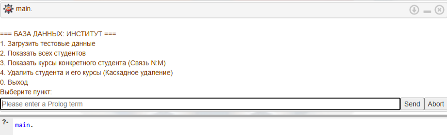
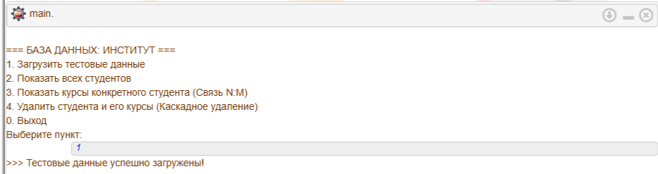
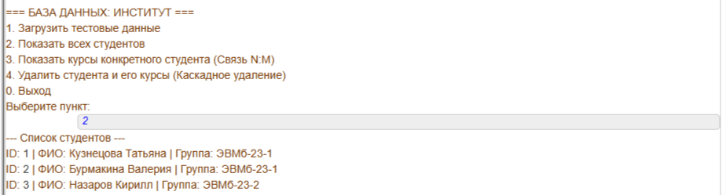
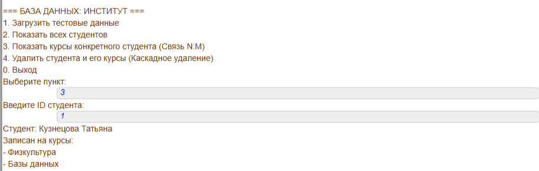
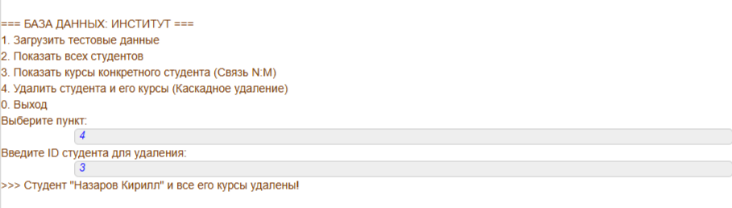
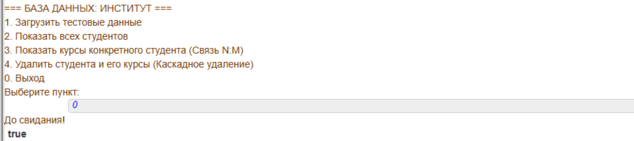

# Лабораторная работа 3: Базы данных на языке Prolog

## Цель работы
Ознакомиться с вариантом реализации принципа реляционных баз данных в виде Пролог-программы. Научиться пользоваться предикатами с побочными действиями, а также
управлять процессом поиска решения Пролог-системой.

## Задание. База данных "Институт"
**(Вариант индивидуального задания №1)**

**Описание:** Реализована база данных, содержащая таблицы «Студенты» (`student/3`) и «Курсы» (`course/2`). Связь между ними реализована через отношение многие-ко-многим `enrollment/2`. Программа управляется через интерактивное меню (`main`).

**Декларативная интерпретация:** Предикат меню `menu_do(4)` (удаление) истинен, если в базе существует студент с введенным ID, и из базы изымается факт существования этого студента, а также все факты его записи на курсы.  
**Процедурная интерпретация:** При удалении студента (выбор пункта 4) система получает ID, физически удаляет факт из памяти с помощью `retract`, а затем применяет `retractall`, чтобы каскадно удалить все вхождения данного ID в таблице зачислений (`enrollment`), сохраняя ссылочную целостность базы данных.

### Тестирование программы и результаты:

0. **Запуск программы.**
   * **Результат:** Запускается бесконечный цикл `repeat`, на экран выводится текстовое меню программы, ожидающее ввода пользователя.
   
   

1. **Инициализация тестовых данных.**
   * **Результат:** База данных очищается от старого(с помощью `retractall`) и заполняется тестовыми записями (с помощью `assertz`).
   
   

2. **Форматированный вывод всех студентов.**
   * **Объяснение:** Пролог использует встроенный механизм возврата (предикат `fail`), чтобы перебрать абсолютно все факты `student` в базе данных и вывести их на экран.
   
   

3. **Запрос со связью многие-ко-многим (N:M).**
   * **Объяснение:** Механизм вывода связывает три таблицы: студентов, зачислений и дисциплин. Из таблицы связей извлекаются ID курсов, по которым подтягиваются их текстовые названия.
   
   

4. **Каскадное удаление данных.**
   * **Объяснение:** Удаляется сам студент. Затем с помощью `retractall(enrollment(DelID, _))` уничтожаются все факты его привязки к курсам. 

   

5. **Выход из программы.**
   * **Объяснение:** При вводе нуля срабатывает правило `menu_do(0)`, которое выводит "До свидания!" и делает отсечение `!`. Затем в главном цикле `main` выполняется условие выхода `Choice == 0`. Так как оно истинно, бесконечный цикл `repeat` прерывается, и программа успешно завершает свою работу.
   
   

## Вывод
В результате выполнения данной лабораторной работы:
1. Освоила работу с динамическими базами данных в Прологе с помощью директивы `:- dynamic`.
2. Построила интерактивное меню пользователя с использованием цикла `repeat` и ввода с клавиатуры `read/1`.
3. Научилась применять предикаты с побочными действиями `assertz` (для добавления фактов), `retract` и `retractall` (для единичного и множественного удаления фактов).
4. Реализовала связь «многие-ко-многим» и организовала вывод данных на экран с использованием перебора (`fail`).
5. Настроила логику каскадного удаления дочерних записей.
6. Разобралась с условиями выхода из зацикленных программ.
