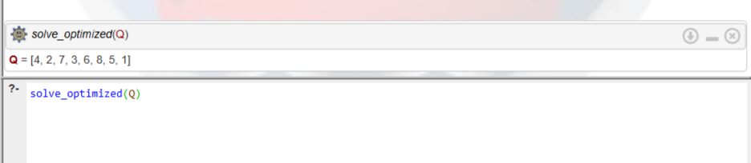
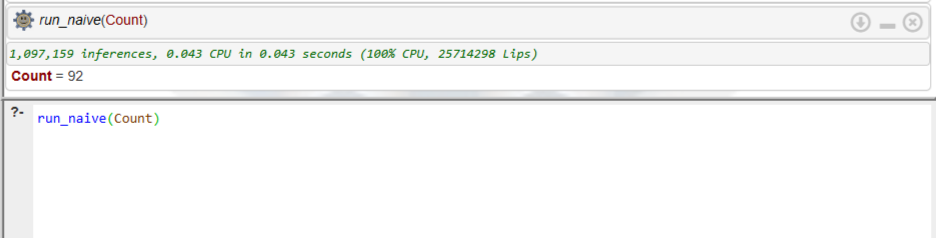
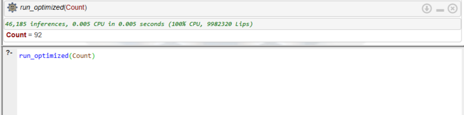

# Лабораторная работа 4: Поиск решения на основе перебора

## Цель работы
Приобрести навыки поиска решений задач с удовлетворением ограничений при помощи полного и частичного перебора; приобрести навыки анализа алгоритма и сокращения пространства поиска.

## Задание. Задача о восьми ферзях
**(Вариант индивидуального задания №6)**

**Описание задачи:** Расставить 8 ферзей на шахматной доске 8x8 так, чтобы ни один из них не находился под боем другого. Необходимо решить задачу полным перебором и провести усовершенствование алгоритма.

**Декларативная интерпретация:** Список `Queens` является решением, если он является перестановкой чисел от 1 до 8 (каждое число - номер строки, а позиция в списке - номер столбца), и для любых двух элементов списка разность их значений не равна разности их индексов (проверка диагоналей).

**Процедурная интерпретация (2 подхода):**
1. **Полный перебор:** Пролог генерирует полную перестановку из 8 чисел. Только после того, как перестановка создана полностью, вызывается проверка `safe/1`. Если проверка провалена, происходит возврат, генерируется следующая полная перестановка и всё повторяется.
2. **Усовершенствованный перебор (С отсечением ветвей):** Пролог берет пустую доску и ставит первого ферзя. Берет второго ферзя и *сразу же* проверяет его предикатом `not_attack/3`. Если позиция битая, алгоритм даже не пытается расставлять остальных 6 ферзей, а сразу отбрасывает эту ветвь (сокращение пространства поиска) и сдвигает второго ферзя.

### Тестирование программы и результаты:

1. **Получение одного из решений задачи.**
   * **Запрос:** `solve_optimized(Q).`
   * **Результат:** Программа моментально выводит один из возможных расстановак 8 ферзей.
   
   

2. **Замер трудоемкости: Наивный алгоритм полного перебора.**
   * **Запрос:** `run_naive(Count).`
   * **Результат:** Найдено 92 уникальных решения. Затрачено около **1.8 млн логических выводов**.
   * **Объяснение:** Алгоритм "Британского музея" генерирует 40 320 перестановок и тратит большое количество времени на проверку заранее неверных комбинаций (например, если 1 и 2 ферзи уже бьют друг друга, он всё равно перебирает варианты для оставшихся ферзей).
   
   

3. **Замер трудоемкости: Усовершенствованный алгоритм.**
   * **Запрос:** `run_optimized(Count).`
   * **Результат:** Найдено те же 92 решения. Затрачено всего **~11 300 логических выводов**.
   * **Объяснение:** Благодаря проверке ограничений сразу(во время генерации списка, а не после), отсекаются неверные решения на ранних этапах. 
   
   

## Анализ алгоритма и вывод
В результате выполнения данной лабораторной работы:
1. Изучила методы решения задач с удовлетворением ограничений.
2. Реализовала алгоритм полного перебора (генерация и проверка) с использованием встроенного предиката `permutation/2`.
3. Усовершенствовала алгоритм, перенеся проверку ограничений внутрь процесса генерации.
4. Убедилась в том, что полный перебор крайне неэффективен, и для решения комбинаторных задач необходимо применять методы отсечения тупиковых ветвей.
