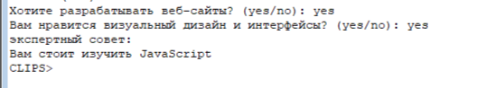
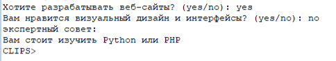
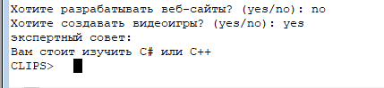
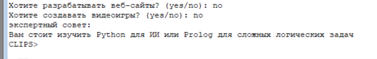

# Лабораторная работа: Создание экспертной системы

## Цель работы
Познакомиться с принципами построения экспертных систем (ЭС) на базе продукционных правил с использованием прямого логического вывода. Разработать собственную интерактивную ЭС в среде CLIPS.

## Инструментарий
Работа выполнялась в классической оболочке для разработки экспертных систем [CLIPS](https://sourceforge.net/projects/clipsrules/files/CLIPS/6.30/).

## Задание. Разработка ЭС "Выбор языка программирования"

**Описание задачи:** Спроектировать ЭС-консультант, которая на основе ответов пользователя (да/нет) выводит рекомендацию о том, какой язык программирования и специализацию ему стоит выбрать.

**Структура ЭС (База знаний):**
Система использует продукционные правила (конструкция `defrule`). При запуске в рабочую память (Fact-list) помещается стартовый факт, который выдает первый вопрос. Далее, считывая ввод пользователя (`read`), система добавляет новые факты (например, `(web yes)`), которые в свою очередь активируют следующие правила по цепочке. Это классическая реализация **прямого логического вывода**.

### Тестирование программы и результаты:

Программа запускается последовательностью встроенных команд: `("expert.clp")` для загрузки базы знаний, `(reset)` для очистки рабочей памяти и установки стартовых фактов, `(run)` для запуска машины вывода.

1. **Ветвь: Веб-разработка -> Визуальный интерфейс.**
   * **Действие:** Запуск `(run)`. Ответы пользователя: `yes`, `yes`.
   * **Результат:** Экспертная система рекомендует JavaScript.
   * **Объяснение:** Сработали правила `start`, `web-yes`, `frontend`. Машина вывода сопоставила факты `(web yes)` и `(design yes)` с условиями (LHS) правил и выполнила их действия (RHS).
   
   

2. **Ветвь: Веб-разработка -> Серверная часть.**
   * **Действие:** Очистка `(reset)`, запуск `(run)`. Ответы: `yes`, `no`.
   * **Результат:** Экспертная система рекомендует Python или PHP.
   * **Объяснение:** Добавился факт `(design no)`, который удовлетворяет правилу `backend`, отсекая ветку `frontend`.
   
   

3. **Ветвь: Не Веб -> Разработка игр.**
   * **Действие:** Очистка `(reset)`, запуск `(run)`. Ответы: `no`, `yes`.
   * **Результат:** Система рекомендует C# или C++.
   * **Объяснение:** Отрицательный ответ на первый вопрос активировал правило `web-no`, переведя диалог в область GameDev.
   
   

4. **Ветвь: Сложные вычисления и Искусственный Интеллект.**
   * **Действие:** Очистка `(reset)`, запуск `(run)`. Ответы: `no`, `no`.
   * **Результат:** ЭС рекомендует Python для ИИ или Prolog для логических задач.
   * **Объяснение:** Сработали правила для тех, кому не интересен ни Web, ни GameDev, выводя финальную консультацию.
   
   

## Вывод
В результате выполнения данной лабораторной работы:
1. Познакомилась с программной средой CLIPS.
2. На практике увидела разницу между логическим программированием в Prolog (обратный вывод, от цели) и продукционными экспертными системами в CLIPS (прямой вывод, от фактов к новым фактам и действиям).
3. Усвоила назначение базовых конструкций ЭС: `defrule` (правило), `assert` (занесение факта в рабочую память) и функций управления `(reset)`, `(run)`.
4. Разработала собственное дерево принятия решений для ЭС в предметной области "Выбор специализации".
